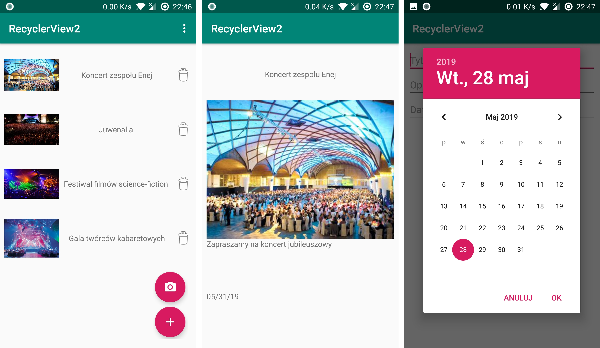

# AndroidDemo2
Prosta aplikacja mobilna do zarządzania listą wydarzeń, wykorzystująca RecyclerView. Przechowuje dane w pliku w postaci JSON. Projekt zrealizowano na potrzeby laboratoriów *Programowania terminali mobilnych (Politechnika Poznańska)*.

